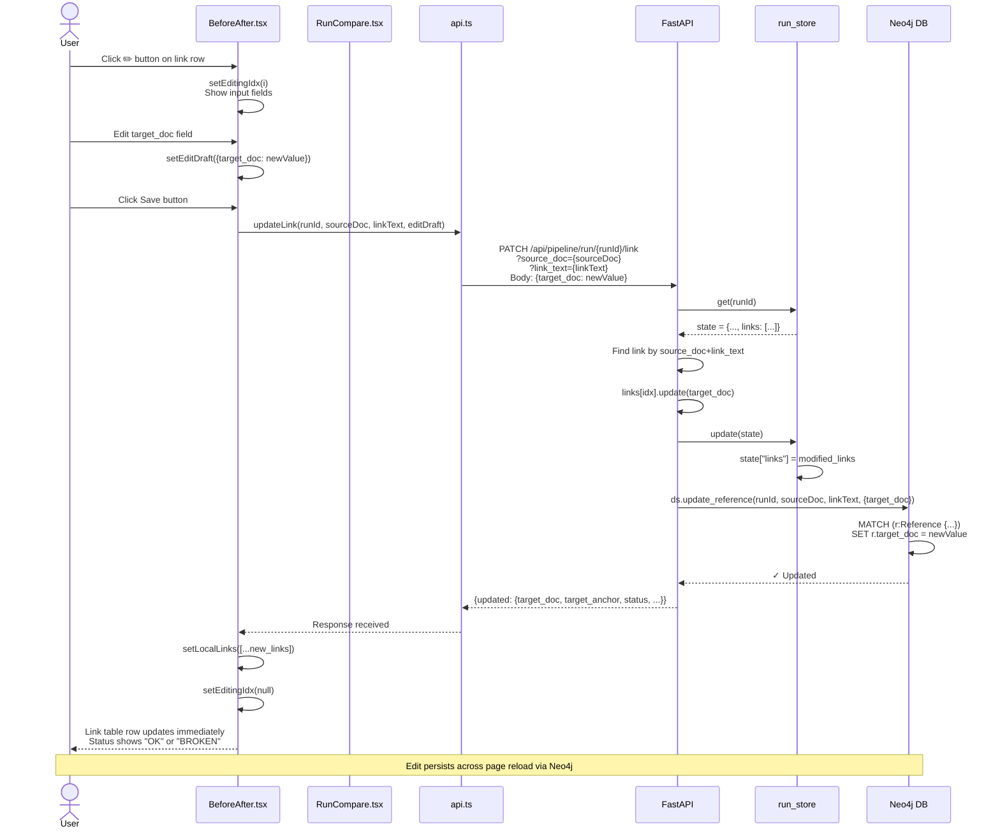
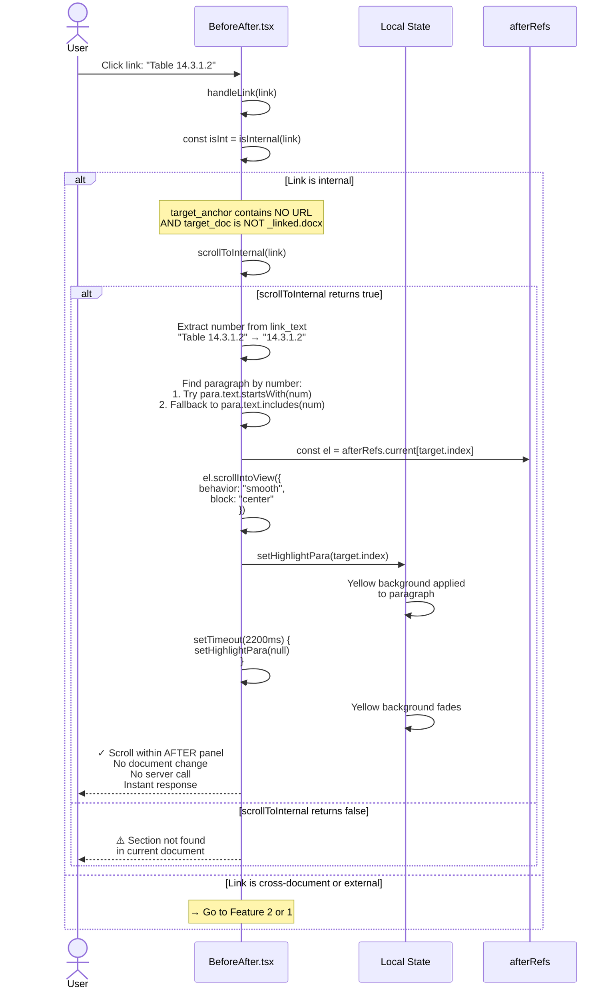
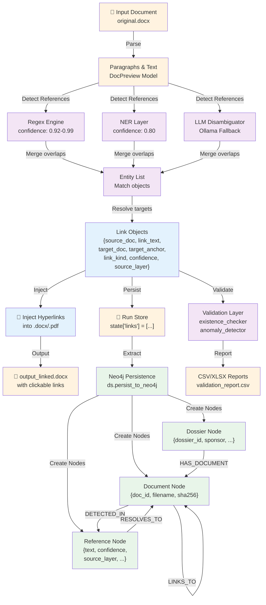
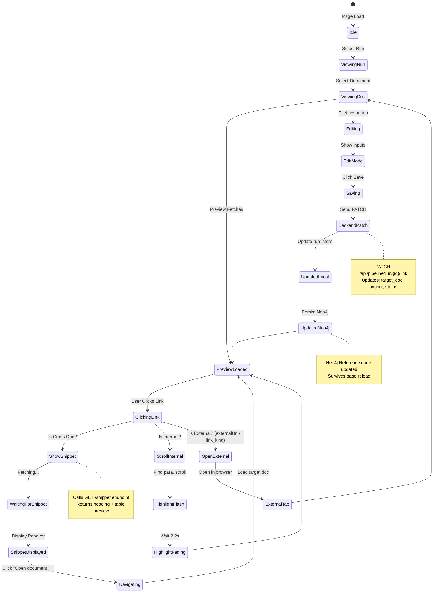
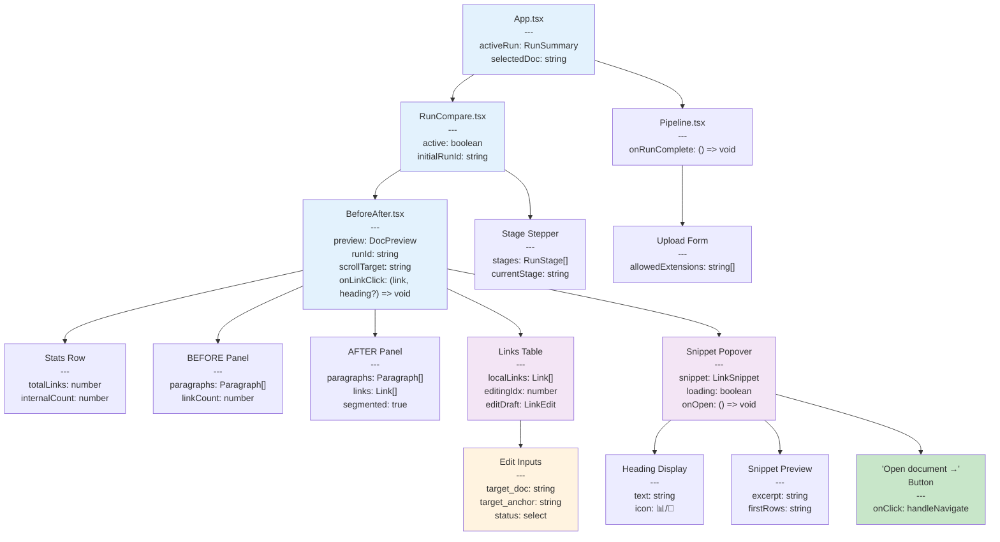
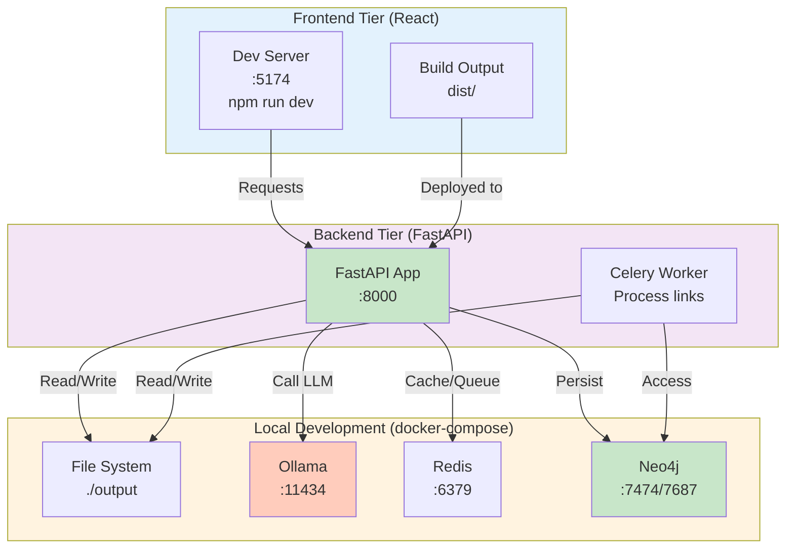
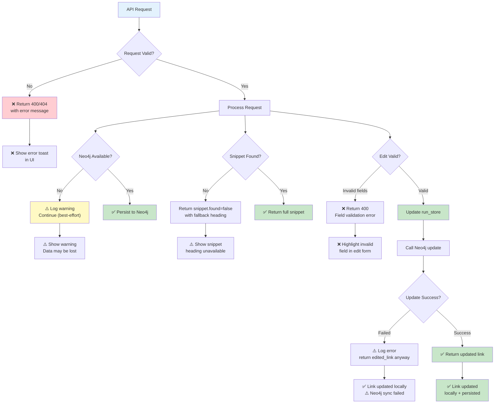
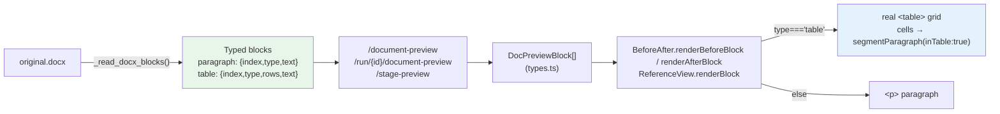
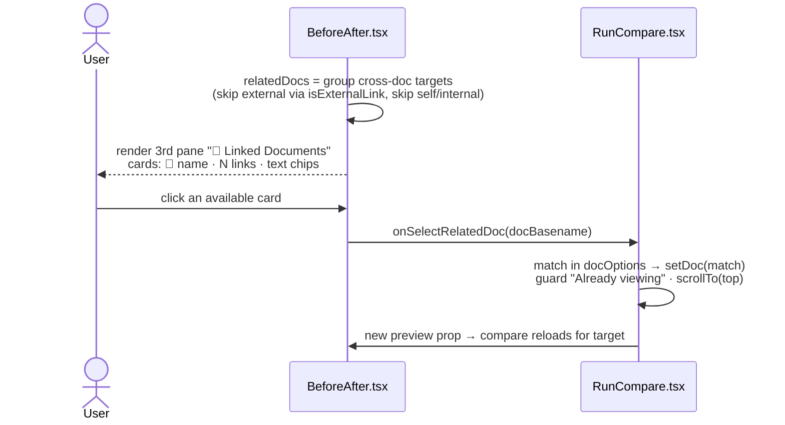
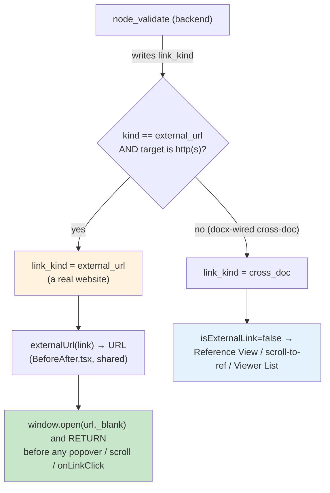

# Complete Application Architecture & Data Flow

> **Auth layer (PLAN SEVEN, 2026-06):** when `HYPERLINK_AUTH_ENABLED=true`, every
> request in the flows below first passes the SuperTokens ASGI middleware
> (`/api/auth/*` signin/signout/refresh) and the global `auth_guard` dependency
> (session cookie → `Principal`, else 401); run-scoped endpoints additionally
> enforce the classified-document gate (403 for non-cleared users). The
> SuperTokens core (:3567) + its Postgres run as two extra Docker containers.
> Diagrams below show the auth-OFF (default) path; full auth sequence diagrams
> live in `docs/auth-supertokens.md`.

## System Architecture Overview

```mermaid
graph TB
    subgraph Frontend["🖥️ FRONTEND (React/TypeScript)"]
        App["App.tsx<br/>Main Shell"]
        Pipeline["Pipeline.tsx<br/>Upload & Process"]
        RunCompare["RunCompare.tsx<br/>Click Handler<br/>Doc Navigation"]
        BeforeAfter["BeforeAfter.tsx<br/>Link Highlighting + Real Tables<br/>Edit UI · Snippet Popover<br/>Viewer List (Linked Docs)<br/>externalUrl/isExternalLink helper"]
        APIClient["api.ts<br/>API Client"]
    end

    subgraph Backend["⚙️ BACKEND (FastAPI/Python)"]
        FastAPI["FastAPI App<br/>app.py"]
        RunEndpoints["GET /run/{id}/link/snippet<br/>PATCH /run/{id}/link<br/>GET /run/{id}/stages"]
        PipelineOrch["Orchestration<br/>LangGraph State"]
        Detection["Detection Layer<br/>Regex + NER + LLM"]
        Injection["Injection Layer<br/>docx_linker<br/>pdf_linker"]
        RunStore["Run Store<br/>In-Memory State"]
    end

    subgraph Graph["📊 NEO4J DATABASE"]
        DossierNode["Dossier Node<br/>dossier_id<br/>sponsor<br/>status"]
        DocNode["Document Node<br/>doc_id<br/>filename<br/>sha256"]
        RefNode["Reference Node<br/>text<br/>confidence<br/>source_layer"]
        LeafNode["Leaf Node<br/>leaf_id<br/>module<br/>path"]
        
        DossierHas["HAS_DOCUMENT<br/>edge"]
        DocPublished["PUBLISHED_AS<br/>edge"]
        RefDetected["DETECTED_IN<br/>edge"]
        RefResolves["RESOLVES_TO<br/>edge"]
        DocLinks["LINKS_TO<br/>edge"]
    end

    subgraph FileSystem["📁 FILE SYSTEM"]
        InputFiles["input/run-id/<br/>original.docx"]
        OutputFiles["output/run-id/linked/<br/>original_linked.docx"]
    end

    %% Frontend connections
    App --> Pipeline
    App --> RunCompare
    Pipeline --> APIClient
    RunCompare --> BeforeAfter
    BeforeAfter --> APIClient

    %% Frontend to Backend
    APIClient -->|HTTP Requests| FastAPI

    %% Backend routing
    FastAPI --> RunEndpoints
    FastAPI --> PipelineOrch
    
    %% Backend services
    RunEndpoints --> RunStore
    PipelineOrch --> Detection
    Detection --> Injection
    Injection --> RunStore

    %% Neo4j persistence
    RunStore -->|update_reference()| RefNode
    PipelineOrch -->|persist_to_neo4j()| DossierNode
    DossierNode -->|HAS_DOCUMENT| DocNode
    DocNode -->|PUBLISHED_AS| LeafNode
    DocNode -->|DETECTED_IN| RefNode
    RefNode -->|RESOLVES_TO| DocNode
    RefNode -->|RESOLVES_TO| LeafNode
    DocNode -->|LINKS_TO| DocNode

    %% File I/O
    InputFiles -->|parse| PipelineOrch
    PipelineOrch -->|inject links| OutputFiles
    Injection -->|writes| OutputFiles

    style Frontend fill:#e3f2fd
    style Backend fill:#f3e5f5
    style Graph fill:#e8f5e9
    style FileSystem fill:#fff3e0
```

---

## Feature 1: Editing Hyperlinks (Full Request/Response Cycle)



---

## Feature 2: Click-to-Navigate with Auto-Scroll (Full Flow)

```mermaid
sequenceDiagram
    actor User
    participant BeforeAfter as BeforeAfter.tsx
    participant Popover as Snippet Popover
    participant RunCompare as RunCompare.tsx
    participant APIClient as api.ts
    participant Backend as FastAPI<br/>Snippet Endpoint
    participant RunStore as run_store

    rect rgb(200, 220, 255)
        Note over User,RunStore: PHASE 1: LINK CLICK & SNIPPET FETCH
    end

    User->>BeforeAfter: Click highlighted link<br/>in AFTER panel
    BeforeAfter->>BeforeAfter: handleLink(link, x, y)
    
    alt isInternal(link) = true
        Note over BeforeAfter: → Go to Feature 3 (Internal Link)
    else isInternal(link) = false
        alt runId is set
            BeforeAfter->>BeforeAfter: openSnippet(link, x, y)
            BeforeAfter->>APIClient: api.pipeline.linkSnippet(runId, target_doc, anchor)
            
            APIClient->>Backend: GET /api/pipeline/run/{runId}/snippet<br/>?doc={target_doc}&anchor={anchor}
            Backend->>RunStore: Get run state
            Backend->>Backend: Load document from state
            Backend->>Backend: Search for table/section<br/>matching anchor
            Backend->>Backend: Extract heading text<br/>and first 3 table rows
            Backend-->>APIClient: {found: true,<br/>heading: "Table 14.2.1.1 - Demographics",<br/>snippet: "Row1;Row2;Row3",<br/>is_table: true,<br/>found_in: "csr-sp-2026-002_linked.docx"}
            
            APIClient-->>BeforeAfter: Snippet data received
            BeforeAfter->>Popover: Display popover with heading & snippet
            Popover-->>User: Show Google-style preview<br/>"Open document →" button visible
        end
    end

    rect rgb(200, 255, 200)
        Note over User,RunCompare: PHASE 2: NAVIGATION & SCROLL
    end

    User->>Popover: Click "Open document →"
    Popover->>Popover: const heading = snippet.data.heading
    Popover->>RunCompare: onLinkClick(link, heading)
    
    RunCompare->>RunCompare: handleLinkClick(link, scrollTargetHeading)
    RunCompare->>RunCompare: const c = classifyLink(link)
    
    alt c.kind = "cross-doc"
        RunCompare->>RunCompare: setScrollTarget(scrollTargetHeading)
        RunCompare->>RunCompare: setDoc(c.target)
        RunCompare-->>User: ✓ Flash: "Followed link → csr-sp-2026-002_linked.docx"
        
        Note over RunCompare: State changes trigger useEffect
        RunCompare->>APIClient: api.pipeline.stagePreview(runId, doc, stage)
        APIClient->>Backend: GET /api/pipeline/run/{runId}/preview?doc=...
        Backend-->>APIClient: {paragraphs: [...], links: [...], ...}
        APIClient-->>RunCompare: preview loaded
        
        RunCompare->>BeforeAfter: Pass preview + scrollTarget as props
    end

    rect rgb(255, 255, 200)
        Note over BeforeAfter: PHASE 3: AUTO-SCROLL AFTER RENDER
    end

    BeforeAfter->>BeforeAfter: useEffect on [preview, scrollTarget]
    BeforeAfter->>BeforeAfter: needle = scrollTarget.slice(0, 60)
    BeforeAfter->>BeforeAfter: target = paragraphs.find(p => p.text includes needle)
    
    BeforeAfter->>BeforeAfter: setTimeout(150ms) {<br/>  el = afterRefs.current[target.index]<br/>  el.scrollIntoView(smooth, center)<br/>  setHighlightPara(target.index)<br/>  setTimeout(2200ms) { setHighlightPara(null) }
    BeforeAfter-->>User: Document scrolls smoothly<br/>to the table heading<br/>Yellow highlight flashes<br/>for 2.2 seconds

    Note over User: User can now see<br/>the exact table they clicked on!
```

---

## Feature 3: Internal Same-Document Links (No Redirect)



---

## Data Flow: From Detection to Neo4j



---

## Neo4j Query Examples

### Query 1: Show All Links in a Document

```cypher
MATCH (doc:Document {doc_id: "csr-sp-2026-001"})
       <-[:DETECTED_IN]-(ref:Reference)-[:RESOLVES_TO]->(target)
RETURN doc.filename, ref.text, ref.confidence, 
       labels(target), target.filename
ORDER BY ref.confidence DESC
```

### Query 2: Find Cross-Document Reference Chains

```cypher
MATCH (doc1:Document)-[l:LINKS_TO {count: gt(0)}]->(doc2:Document),
      (doc2:Document)-[l2:LINKS_TO {count: gt(0)}]->(doc3:Document)
RETURN doc1.filename, doc2.filename, doc3.filename
LIMIT 20
```

### Query 3: Update a Reference After Edit

```cypher
MATCH (r:Reference {
  run_id: "2026-01-15-14-32-45",
  source_doc: "csr-sp-2026-001",
  link_text: "Table 14.2.1.1"
})
SET r.target_anchor = "14.2.1.1_updated",
    r.target_doc = "csr-sp-2026-002_linked.docx"
RETURN r
```

### Query 4: View Dossier-Level Statistics

```cypher
MATCH (d:Dossier {dossier_id: "DOS-2026-DEMO"})
       -[:HAS_DOCUMENT]->(doc:Document)
       <-[:DETECTED_IN]-(ref:Reference)
RETURN d.dossier_id,
       COUNT(DISTINCT doc) as doc_count,
       COUNT(ref) as link_count,
       AVG(ref.confidence) as avg_confidence,
       COLLECT(DISTINCT ref.source_layer) as sources
```

---

## HTTP Request/Response Examples

### PATCH: Update Link

**Request:**
```http
PATCH /api/pipeline/run/2026-01-15-14-32-45/link?source_doc=csr-sp-2026-001&link_text=Table%2014.2.1.1
Content-Type: application/json

{
  "target_doc": "csr-sp-2026-002_linked.docx",
  "target_anchor": "14.2.1.1_demographics",
  "status": "ok"
}
```

**Response:**
```json
{
  "updated": {
    "source_doc": "csr-sp-2026-001",
    "link_text": "Table 14.2.1.1",
    "target_doc": "csr-sp-2026-002_linked.docx",
    "target_anchor": "14.2.1.1_demographics",
    "status": "ok",
    "confidence": 0.95,
    "source_layer": "regex"
  }
}
```

### GET: Link Snippet

**Request:**
```http
GET /api/pipeline/run/2026-01-15-14-32-45/snippet?doc=csr-sp-2026-002_linked.docx&anchor=Table%2014.2.1.1
```

**Response:**
```json
{
  "found": true,
  "doc": "csr-sp-2026-002_linked.docx",
  "found_in": "csr-sp-2026-002_linked.docx",
  "heading": "Table 14.2.1.1 - Subject Demographics (Intent-to-Treat Population)",
  "snippet": "Characteristic ; Solzumab 200 mg ; Solzumab 100 mg ; Placebo ; Total",
  "is_table": true,
  "matched": true
}
```

---

## State Management Flow



---

## Component Hierarchy & Props Flow



---

## Deployment Architecture



---

## Error Handling & Recovery



---

## Timeline: Feature Demonstration Walkthrough

```mermaid
timeline
    title Feature Demo Timeline (5 minutes)
    
    section 0:00-1:00
        Upload: Use Pipeline screen
        Upload: Select enhanced CSR dossier
        Upload: Run hyperlink detection
        
    section 1:00-2:30
        : Open Run Compare
        : Select completed run
        : Select first CSR document
        Link Click: Click cross-document link in AFTER panel
        Snippet: Show Google-style snippet popover
        Snippet: Point out heading + table preview
        
    section 2:30-3:30
        Navigate: Click "Open document →"
        Scroll: Document changes + auto-scrolls to table
        Highlight: Yellow highlight flashes
        Check: Verify correct table is visible
        
    section 3:30-4:30
        Internal: Click internal link (same document)
        Instant: NO popover, NO server call
        Scroll: Direct scroll within AFTER panel
        
    section 4:30-5:00
        Edit: Click ✏️ button on broken link
        Edit: Show edit inputs + Save button
        Save: Change target_anchor → Save
        Result: Link updates immediately
        Persist: Reload page → values still changed (Neo4j)
```

---

## Features 4–6: Real Tables, Viewer List & Authoritative External Routing (PLAN FIVE / PLAN SIX)

### Feature 4 — Structured blocks → real HTML tables



- One backend function (`_read_docx_blocks`) fixes all three preview panels.
- `text` is preserved on every block, so `scrollToInternal` / snippet search / any
  `p.text` scan still locate a table by its dotted number.

### Feature 5 — Viewer List (BEFORE | AFTER | Linked Documents)



- No new endpoint — the list is derived from the preview's own links.
- `runDocs` (= `docOptions`) marks targets not in this run as muted.

### Feature 6 — External links ALWAYS open externally (authoritative `link_kind`)



- `externalUrl` / `isExternalLink` are the **single source of truth**, imported by
  `RunCompare.classifyLink` / `handleLinkClick` and `ReferenceView.handleInnerLink`.
- Authoritative `link_kind` first; raw-`^https?://` fallback keeps **legacy runs**
  (created before the field) working. The only `^https?://` test left in the
  frontend lives inside `externalUrl`.

