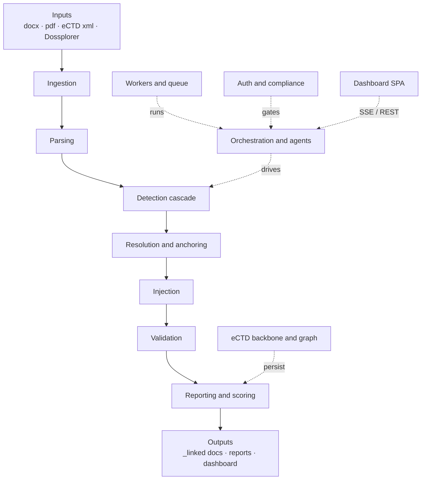

# Hyperlink Engine — knowledge vault

AI-powered hyperlink automation & validation for regulatory eCTD/CTD dossiers: it detects
reference patterns in finished Word/PDF documents, injects hyperlinks into new `_linked` copies,
validates link integrity, and reports submission readiness — all on-prem / GxP-aligned.
Sources: `README.md`, `ARCHITECTURE_FLOW.md`.

## Pipeline layers
[[Ingestion layer]] · [[Parsing layer]] · [[Detection cascade]] · [[Resolution and anchoring]] · [[Injection layer]] · [[Validation layer]] · [[Reporting and scoring]]

## Platform
[[Orchestration and agents]] · [[Workers and queue]] · [[eCTD backbone and graph]] · [[Auth and compliance]]

## Frontend features
[[Pipeline run and live status]] · [[Run Compare and link navigation]] · [[Reports and review screens]]

## Ops & reference
[[Running the app]] · [[Key files]]

Open as a graph (Obsidian): Open folder as vault → pick this `docs/knowledge` folder → Graph view.
